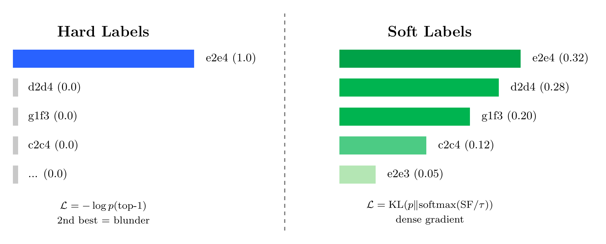
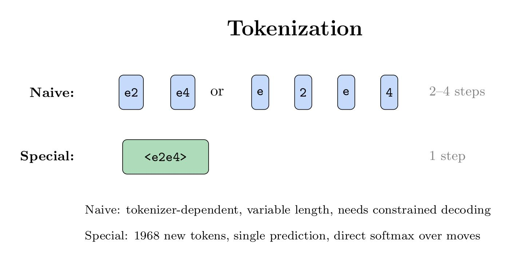
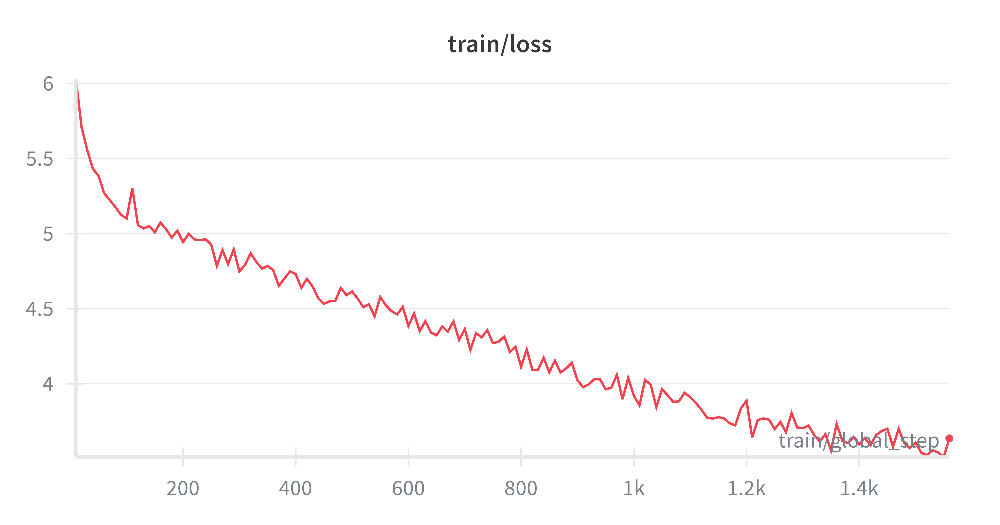
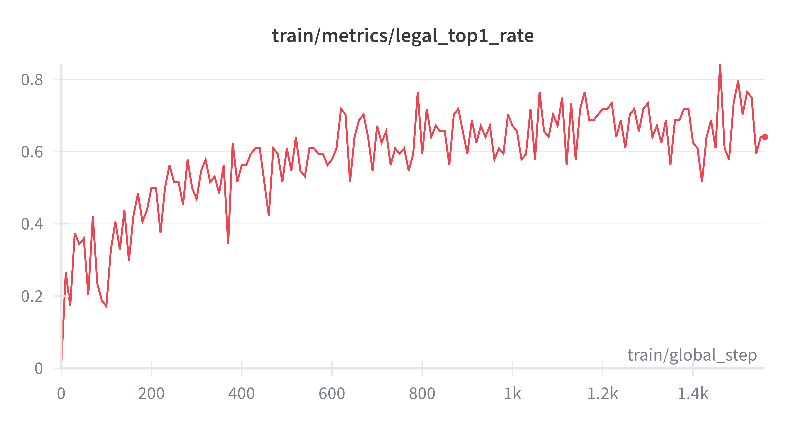
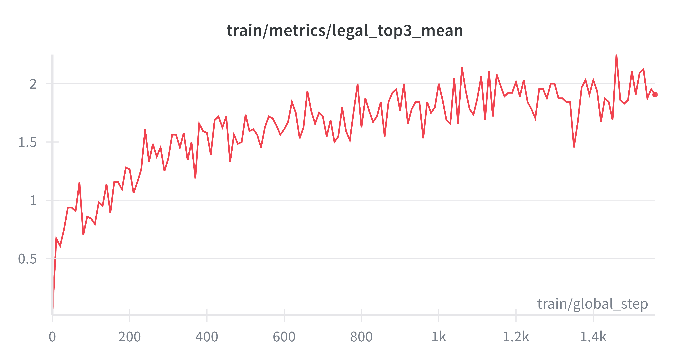
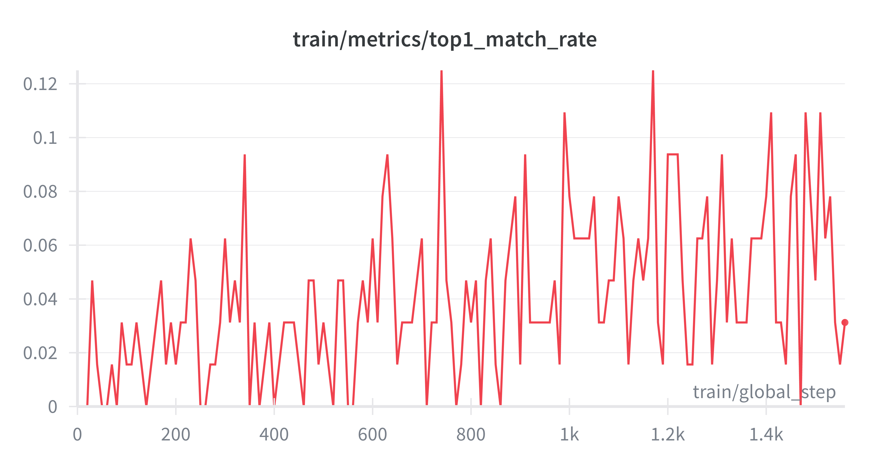

# Chess LLM: Stockfish Distillation with Soft Labels

Training language models to play chess by distilling Stockfish's knowledge into soft probability distributions over moves, **while preserving conversational abilities** 
(_Otherwise, what's the point, just use Stockfish directly?_).

## Goals

1. **Strong chess play** — Learn from Stockfish's evaluations, not just its top move
2. **Preserve conversation** — The model should still chat, explain moves, and reason about chess
3. **Single-token moves** — Efficient inference with special move tokens
4. **Soft knowledge transfer** — Teach that multiple moves can be good, not just one "correct" answer

Unlike the DeepMind paper which built a **chess-only** model, we fine-tune an **instruct-tuned LLM** with the goal of creating a model that can both play strong chess AND discuss it conversationally — like a chess tutor that can explain its reasoning.

## Approach

Unlike standard behavioral cloning (predicting the single best move), we distill the **full move quality distribution** from Stockfish into the model. This provides denser gradient signal and teaches the model that multiple moves can be good.

### Key Ideas

| Aspect | Naive SFT | Our Approach |
|--------|-----------|--------------|
| **Labels** | One-hot on best move | Soft distribution over all legal moves |
| **Tokens** | Native tokenizer (variable length) | Special `<uci_move>` tokens (single token) |
| **Gradient** | Sparse (1 move gets signal) | Dense (all legal moves get signal) |
| **2nd-best move** | Same penalty as blunder | Small penalty |
<!-- | **Loss** | Cross-entropy | KL divergence | -->

### Soft Labels vs Hard Labels

<p align="center">
  
</p>

**Hard labels** (left) assign probability 1.0 to Stockfish's top move and 0.0 to everything else. This creates conflicting gradients when similar positions have different "best" moves.

**Soft labels** (right) distribute probability according to Stockfish's centipawn evaluations:

```python
probs = softmax(stockfish_centipawns / temperature)
```

This teaches the model that e2e4 (0.32) and d2d4 (0.28) are both strong, while h2h4 (0.02) is weak.

### Tokenization Strategy

<p align="center">
  
</p>

**Naive tokenization** splits UCI moves into variable-length token sequences (`e`, `2`, `e`, `4`), requiring:
- Multi-step autoregressive decoding
- Constrained decoding to prevent illegal combinations
- Complex marginalization for soft labels

**Special tokens** add ~1968 move tokens (`<e2e4>`, `<d2d4>`, etc.) to the vocabulary:
- Single decoding step
- Direct softmax over legal moves
- Perfect alignment with Stockfish distributions

### Legal Move Smoothing

To teach move legality even with partial scoring (top-k moves only), we add a small uniform probability over all legal moves:

```python
target = (1 - α) * stockfish_probs + α * uniform_over_legal
```

With `α=0.1`, the model learns which moves are legal while still prioritizing quality.

### Preserving Conversational Abilities

Fine-tuning on chess-only data causes **catastrophic forgetting** — the model loses its ability to chat normally. Our strategy:

| Technique | Purpose |
|-----------|---------|
| **LoRA fine-tuning** | Freeze most weights, limit capacity for forgetting |
| **Chat data mixing** | Include 10-15% general conversation during training |
| **Format tokens** | `<uci_move>...</uci_move>` clearly separates chess from chat |

**Current status**: Initial experiments without chat mixing showed token leakage (move tokens appearing in regular conversation). This confirms that chat data mixing is essential.

---

## Relation to Prior Work

Our approach builds on [**Grandmaster-Level Chess Without Search**](https://arxiv.org/abs/2402.04494) (Ruoss et al., 2024), which trained a 270M transformer to play chess at 2895 Elo.

| Aspect | DeepMind Paper | Our Approach |
|--------|----------------|--------------|
| Architecture | Custom transformer (270M) | Fine-tuned instruct LLM (0.5B+) |
| Output | Q(s,a) per move → argmax | Direct move prediction |
| Inference calls | N (one per legal move) | 1 |
| Labels | One-hot on Q-value bin | Soft distribution over moves |
| **Conversational** | **No** | **Yes — key goal** |
| Training | From scratch | LoRA fine-tuning |

The paper noted (Section B.2):

> *"We suspect that training on the full action distribution of the oracle (with cross-entropy loss), rather than the best action only would largely close this gap, but we consider this question beyond the scope of this paper."*

**This is exactly what we implement.**

### Why Preserve Conversation?

A chess-only model can play moves but can't:
- Explain why a move is good or bad
- Discuss opening theory or endgame principles  
- Teach chess concepts to beginners
- Analyze games in natural language

By fine-tuning an instruct model with LoRA and mixing chat data, aim is to create a **chess tutor** and not just a chess engine.

---

## Training Results

Initial experiments on **100k positions** with **top-3 move scoring**, **Qwen2.5-0.5B-Instruct**, **1 epoch**:

### Training Loss

<p align="center">
  
</p>

Loss decreases smoothly from ~6.0 to ~3.5, indicating healthy learning. The curve hadn't plateaued — more training would help.

### Legal Move Prediction

<p align="center">
  
</p>

**legal_top1_rate**: How often the model's top prediction is a legal move.

| Stage | Value | Notes |
|-------|-------|-------|
| Start | ~5% | Random (1968 tokens, ~35 legal) |
| End | ~65% | Model learned legality ✓ |

<p align="center">
  
</p>

**legal_top3_mean**: Average number of legal moves in top-3 predictions.

- Start: ~0.2/3
- End: ~2.0/3

### Move Quality Matching

<p align="center">
  
</p>

**top1_match_rate**: How often model's top-1 matches Stockfish's top-1.

Stayed around 3-5% throughout. This metric is **harsh for soft-label training** — the model learns to distribute probability across good moves, not concentrate on one. A fairer metric would be "Is model's top-1 in Stockfish's top-3?"

### Training Configuration

```python
{
    'model_name': 'unsloth/Qwen2.5-0.5B-Instruct',
    'per_device_train_batch_size': 64,
    'learning_rate': 2e-4,
    'num_train_epochs': 1.0,
    'temperature': 1.0,
    'cp_scale': 100.0,
    'legal_move_smoothing': 0.1,
    'lora_r': 16,
    'lora_alpha': 16,
}
```

---

## Findings

### ✓ What Worked

| Finding | Evidence |
|---------|----------|
| **Soft labels enable legality learning** | 5% → 65% legal predictions |
| **Loss trains smoothly** | No gradient conflicts, stable loss curve |
| **Legal move smoothing** | Teaches legality even with sparse top-k scoring |
| **LoRA with embedding layers** | Successfully trains new token representations |

### ⚠️ Issues Identified

| Issue | Impact | Solution |
|-------|--------|----------|
| **Linear LR decay too aggressive** | Learning rate hit ~5e-7 by end, stopped learning | Use cosine schedule |
| **Chat capability degradation** | Move tokens leak into regular generation | Mix 10-15% chat data |
| **No warmup** | Potentially unstable early training | Add 3% warmup ratio |

---

## Future Work

### High Priority

- [ ] **Mix 10-15% chat data** — Critical for preserving conversational abilities
- [ ] **Cosine LR schedule** with warmup to prevent learning rate collapse
- [ ] **More epochs** (3-5) — loss was still decreasing
- [ ] **Lower legal_move_smoothing** (0.01-0.05) to strengthen quality signal

### Medium Priority

- [ ] **Scale to 1M+ positions** for better generalization
- [ ] **Score all legal moves** instead of top-3 for complete distributions
- [ ] **Add top-3 match rate metric** — fairer evaluation for soft labels
- [ ] **Evaluate on puzzle accuracy** following the paper's methodology
- [ ] **Kendall's τ metric** — measure move ranking correlation with Stockfish

### Research Directions

- [ ] **Chain-of-thought chess** — generate `<thinking>...</thinking>` before move
- [ ] **Move explanations** — train model to explain its moves in natural language
- [ ] **Model size scaling** — compare 0.5B, 1.5B, 7B performance
- [ ] **Hybrid training** — combine soft labels with GRPO/DPO for self-play

---

## Usage

### Generate Dataset

```bash
python generate_dataset.py 100000 \
    --out train.jsonl \
    --topk 10 \
    --nodes 20000 \
    --stockfish /path/to/stockfish \
    --streaming
```

### Train Model

```bash
python train_distill.py \
  --model-name unsloth/Qwen2.5-1.5B-Instruct
  --log-level DEBUG \
  --suppress-noisy-logs \
  --log-legal-metrics \
  --train-jsonl ./train.jsonl \
  --use-wandb \
  --wandb-project chess-distill \
  --wandb-run-name exp-cosine-lr \
  --per-device-train-batch-size 32 \
  --lr-scheduler-type cosine \
  --warmup-ratio 0.03 \
  --learning-rate 2e-4 \
  --logging-steps 20 \
  --max-seq-length 256 \
  --fp16 \
  --user-message-template user_templates/fen_board_template.jinja \
  > output.log 2>&1
```

### Test Model

```bash
python test_next_token_logits.py \
    --model-dir ./outputs_chess_distill \
    --fen "rnbqkbnr/pppppppp/8/8/8/8/PPPPPPPP/RNBQKBNR w KQkq - 0 1" \
    --topk 10
```

---

## Project Structure

```
├── chess_distill/
│   ├── data.py              # Dataset and soft label construction
│   ├── move_tokens.py       # UCI move token generation (1968 moves)
│   ├── tokenizer_utils.py   # Vocabulary extension utilities
│   └── trainer.py           # Custom trainer
├── generate_dataset.py      # Stockfish annotation pipeline
├── train_distill.py         # Main training script
├── test_next_token_logits.py
└── test_chat_model.ipynb
```

---

## Citation

```bibtex
@misc{chessdistill2025,
  title   = {Chess LLM: Stockfish Distillation with Soft Labels},
  author  = {Mahammad Nuriyev},
  year    = {2025},
  url     = {https://github.com/maminrayej/chess-distill}
}
```

Related work:

```bibtex
@article{ruoss2024grandmaster,
  title   = {Grandmaster-Level Chess Without Search},
  author  = {Ruoss, Anian and Delétang, Grégoire and Medapati, Sourabh and others},
  journal = {arXiv preprint arXiv:2402.04494},
  year    = {2024}
}
```

---

## License

MIT
